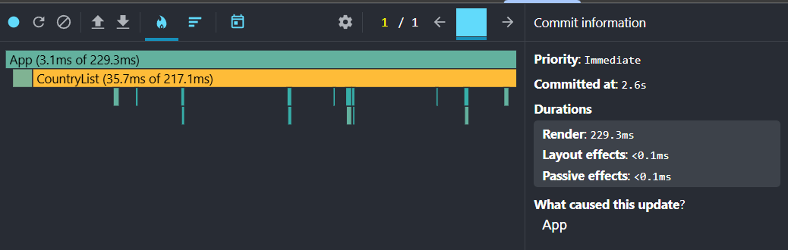
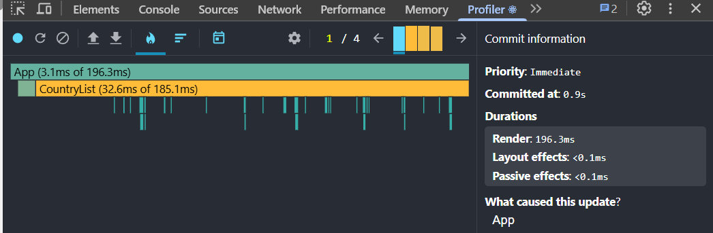

# Performance Optimization Report

## Baseline Measurements

### Interaction A: Sort countries

- **Commit duration**: 0.1 ms
- **Render duration**: 211.9 ms
- **Screenshot**: 

### Interaction B: Search countries

- **Commit duration**: 0.1 ms
- **Render duration**: 92.2 ms
- **Screenshot**: 

### Interaction C: Change year

- **Commit duration**: 0.1 ms
- **Render duration**: 229.3 ms
- **Screenshot**: 

### Interaction D: Toggle column

- **Commit duration**: 0.1 ms
- **Render duration**: 196.3 ms
- **Screenshot**: 

## Summary of Improvements

| Interaction      | Baseline (ms) | Optimized (ms) | Improvement |
| ---------------- | ------------- | -------------- | ----------- |
| Sort countries   | 211.9         | \_\_\_         | \_\_\_%     |
| Search countries | 92.2          | \_\_\_         | \_\_\_%     |
| Change year      | 229.3         | \_\_\_         | \_\_\_%     |
| Toggle column    | 196.3         | \_\_\_         | \_\_\_%     |
| **Average**      | **182.425**   | **\_\_\_**     | **\_\_\_%** |
