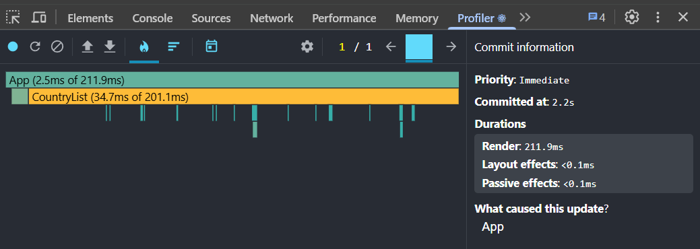
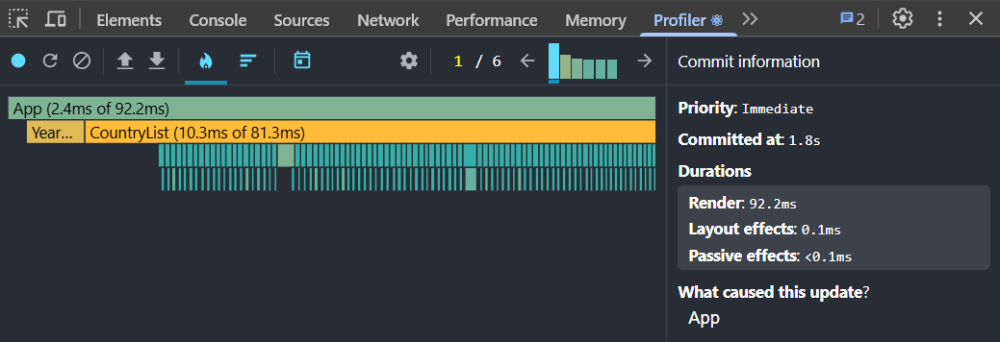
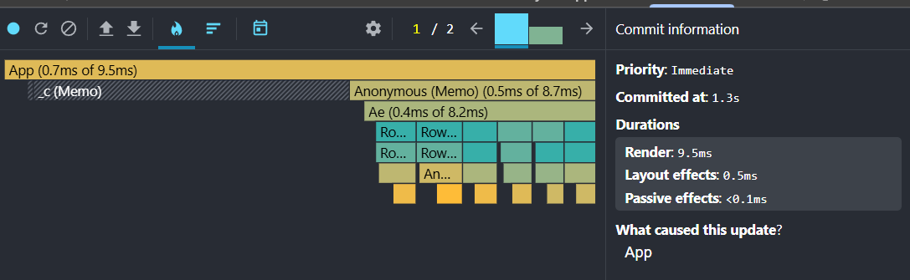
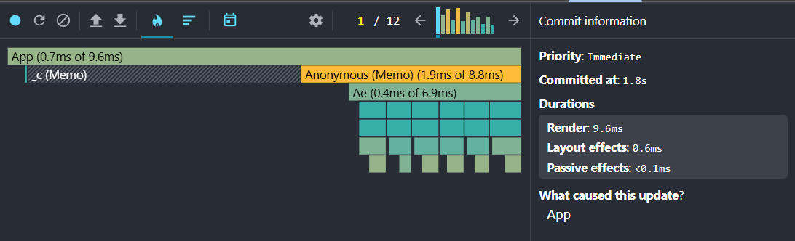
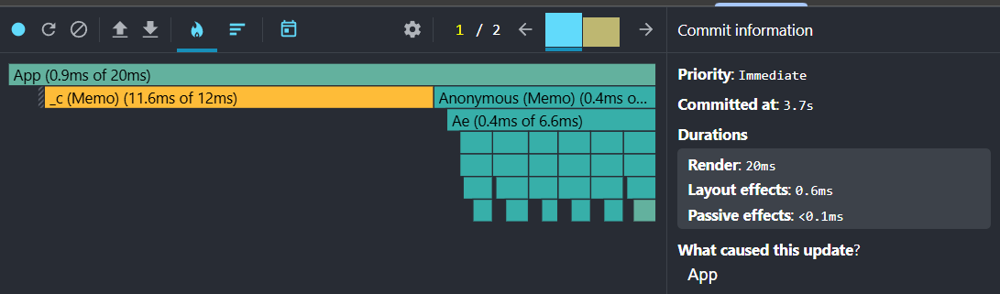
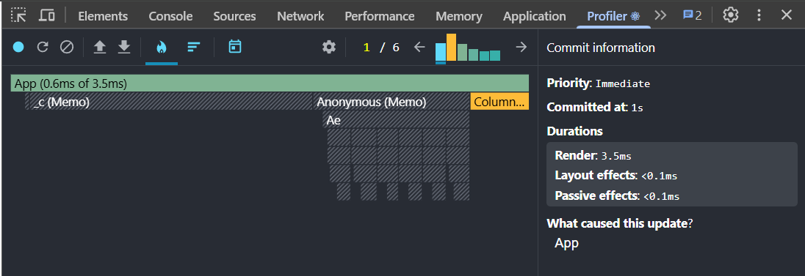

# Performance Optimization Report

## Baseline Measurements

### Interaction A: Sort countries

- **Commit duration**: 0.1 ms
- **Render duration**: 211.9 ms
- **Screenshot**: 

### Interaction B: Search countries

- **Commit duration**: 0.1 ms
- **Render duration**: 92.2 ms
- **Screenshot**: 

### Interaction C: Change year

- **Commit duration**: 0.1 ms
- **Render duration**: 229.3 ms
- **Screenshot**: 

### Interaction D: Toggle column

- **Commit duration**: 0.1 ms
- **Render duration**: 196.3 ms
- **Screenshot**: 

## Optimized Measurements

### Interaction A: Sort countries

- **Commit duration**: 0.5 ms
- **Render duration**: 9.5 ms
- **Screenshot**: 

### Interaction B: Search countries

- **Commit duration**: 0.6 ms
- **Render duration**: 9.6 ms
- **Screenshot**: 

### Interaction C: Change year

- **Commit duration**: 0.6 ms
- **Render duration**: 20 ms
- **Screenshot**: 

### Interaction D: Toggle column

- **Commit duration**: 0.1 ms
- **Render duration**: 3.5 ms
- **Screenshot**: 

## Summary of Improvements

| Interaction      | Baseline (ms) | Optimized (ms) | Improvement |
| ---------------- | ------------- | -------------- | ----------- |
| Sort countries   | 211.9         | 9.5            | 95.5%       |
| Search countries | 92.2          | 9.6            | 89.6%       |
| Change year      | 229.3         | 20             | 91.3%       |
| Toggle column    | 196.3         | 3.5            | 98.2%       |
| **Average**      | **182.4**     | **10.7**       | **94.1%**   |
